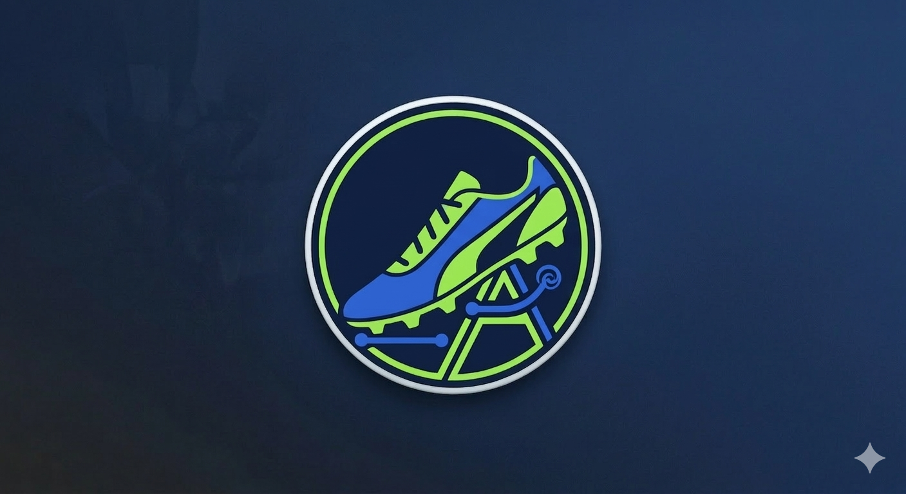
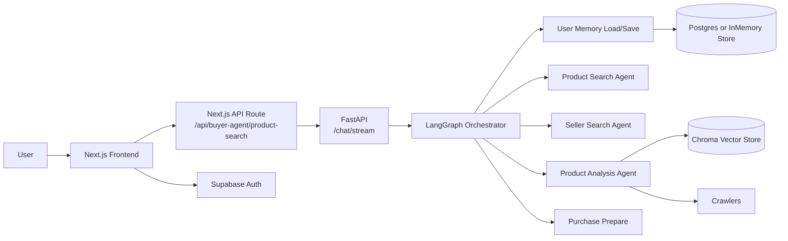
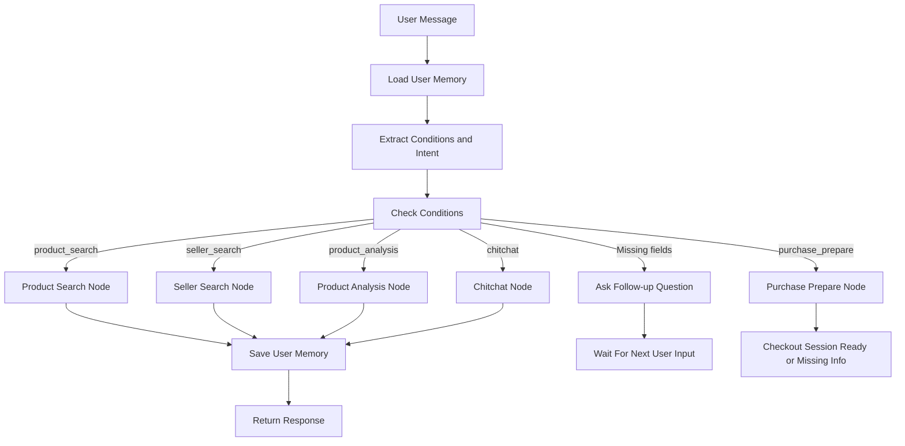
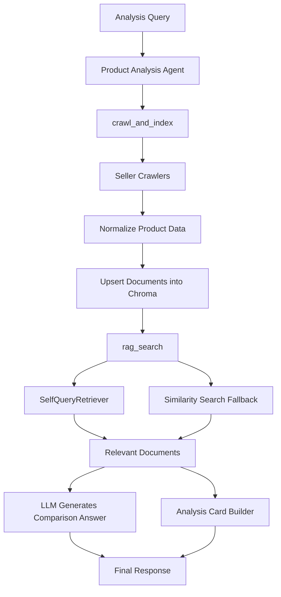

# Buyer Agent SaaS

축구화 구매 탐색을 대화형 워크플로우로 풀어낸 프로젝트입니다.

사용자는 자연어로 조건을 말하고, 시스템은 그 입력을 구조화한 뒤 상품 추천, 판매처 탐색, 상품 비교 분석, 구매 준비 단계까지 이어서 처리합니다. 이 저장소는 단순한 데모가 아니라, LLM 기능을 실제 제품 구조로 바꾸는 과정을 보여주기 위한 포트폴리오 성격의 프로젝트입니다.

## Key Contributions

- `LangGraph` 기반 Buyer Agent를 설계해 상품 추천, 판매처 탐색, 상품 분석, 구매 준비를 상태 기반 워크플로우로 오케스트레이션
- `FastAPI + Next.js` 구조 위에서 `SSE` 스트리밍 응답을 연결해 에이전트 진행 상태와 결과를 실시간으로 제공
- `crawl_and_index -> Chroma -> rag_search`로 이어지는 Agentic RAG 파이프라인을 구축해 크롤링 기반 상품 데이터를 분석 흐름에 연결
- 사용자 조건 추출, 후속 질문 생성, 메모리 저장을 결합해 불완전한 입력에서도 이어지는 대화형 구매 흐름 구현



## Why

축구화 구매는 검색 한 번으로 끝나지 않습니다.

- 예산, 포지션, 지면 조건에 맞는 모델을 먼저 좁혀야 합니다.
- 판매처별 가격, 사이즈, 재고를 따로 확인해야 합니다.
- 추천이 나와도 왜 그 모델이 적합한지 설명이 필요합니다.
- 구매 직전에는 다시 제품 선택, 사이즈, 배송정보 입력 단계가 필요합니다.

이 프로젝트는 이 과정을 "한 번 답하는 챗봇"이 아니라, 상태를 가진 Buyer Agent로 다루는 데 초점을 뒀습니다.

## What It Does

현재 저장소 기준 핵심 범위는 다음과 같습니다.

- Next.js 기반 랜딩 페이지와 대시보드
- Supabase Google OAuth 로그인
- 사용자별 대화 히스토리 관리
- FastAPI 기반 AI 백엔드
- LangGraph 기반 intent 분기와 상태 전이
- 조건 부족 시 후속 질문 생성
- 상품 추천, 판매처 탐색, 상품 분석 분리
- RAG 기반 상품 분석 파이프라인
- 구매 준비 정보 수집

아직 완성형 제품으로 보기는 어렵습니다.

- 테스트 범위가 충분히 넓지 않습니다.
- 크롤링과 인덱싱 안정성은 더 보강이 필요합니다.
- 결제 완료 자동화보다는 checkout preparation 단계에 가깝습니다.
- 실험 코드와 제품 코드가 일부 함께 존재합니다.

포트폴리오 관점에서는 이 경계를 숨기지 않는 편이 낫다고 판단했습니다.

## Core Design

### 1. Stateful agent workflow

핵심 흐름은 LangGraph로 구성했습니다. 단일 프롬프트 앱이 아니라, 현재 의도와 누적 조건, 이전 검색 결과, 사용자 메모리, 구매 상태를 함께 다룹니다.

주요 노드는 다음과 같습니다.

- `load_user_memory`
- `extract_conditions_and_intent`
- `check_conditions`
- `ask_missing_node`
- `product_search_node`
- `seller_search_node`
- `product_analysis_node`
- `purchase_prepare_node`
- `save_user_memory`

이 구조를 택한 이유는 단순합니다. 추천, 판매처 탐색, 비교 분석, 구매 준비는 서로 다른 책임이고, 이를 한 번의 모델 호출에 밀어 넣을수록 디버깅과 확장이 어려워지기 때문입니다.

### 2. Incomplete input handling

사용자는 처음부터 모든 조건을 주지 않습니다. 그래서 메시지에서 조건을 구조화해 추출하고, 부족한 슬롯은 다시 질문하는 흐름을 넣었습니다.

- 예산, 브랜드, 지면, 포지션, 연령대, 상품명, 판매처 추출
- 부족한 필드는 질문 시퀀스로 보완
- 후속 답변은 기존 조건과 merge
- 조건이 충분해지면 적절한 agent node로 이동

즉 검색창이 아니라, 상담형 인터페이스에 가까운 UX를 목표로 했습니다.

### 3. Streaming-first UX

프론트는 완성된 결과를 한 번에 받지 않습니다. Next.js API route가 FastAPI `/chat/stream`에 연결되고, 백엔드는 SSE로 진행 상태와 최종 결과를 순차적으로 반환합니다.

이 구조를 통해 사용자 화면에는 다음이 함께 나타납니다.

- 현재 어떤 단계가 실행 중인지
- 응답이 스트리밍 중인지
- 최종 결과에 어떤 카드 데이터가 붙는지

구매 탐색처럼 검색, 크롤링, 분석이 함께 걸리는 작업에서는 이 방식이 UX상 더 설득력 있다고 봤습니다.

## System Architecture



핵심은 두 가지입니다.

- 프론트는 orchestration 세부사항을 모르고 API route만 바라봅니다.
- 상품 분석은 단순 LLM 호출이 아니라 crawler와 vector store를 거치는 별도 서브시스템입니다.

## Buyer Agent Flow



이 흐름은 "챗봇이 대답한다"보다 "현재 상태에 맞는 작업 노드로 라우팅한다"는 관점에서 보는 편이 정확합니다.

## RAG Pipeline

이 프로젝트에서 가장 중요한 기술 축 중 하나는 상품 분석입니다. 비교 분석은 단순히 LLM에 "비교해줘"라고 묻는 방식이 아니라, `crawl_and_index`와 `rag_search`를 묶은 파이프라인 위에서 동작합니다.



구현 포인트는 아래와 같습니다.

- 크롤링과 검색을 분리했습니다.
- 상품 데이터를 `Document + metadata` 형태로 적재합니다.
- `seller`, `product_price`, `product_category`, `age_group`, `ground_type`를 retrieval metadata로 사용합니다.
- retrieval 실패 시 similarity search fallback을 둡니다.
- 최종 텍스트 응답과 별개로 프론트에서 바로 쓸 수 있는 analysis card 데이터도 만듭니다.

즉 이 프로젝트의 RAG는 "문서 몇 개 붙여서 답변 생성"이 아니라, 크롤링된 상품 데이터를 구조화하고 그 위에 retrieval 전략을 얹는 방식입니다.

## Retrieval Design

`backend/Tools/crawl_and_index.py`와 `backend/Tools/rag_search.py` 기준 현재 retrieval 설계는 다음과 같습니다.

- 판매처별 crawler 결과를 공통 포맷으로 정규화
- `Chroma` 단일 shared vectorstore에 upsert
- 동일 조건 재요청 시 registry로 중복 인덱싱 방지
- 판매처 alias를 canonical display name으로 정규화
- multi-seller query는 병렬 retrieval 수행
- query constructor로 가격, 지면, 카테고리 조건을 metadata filter로 해석

여전히 다듬을 부분은 남아 있지만, 검색과 분석을 모델 추론 하나에 뭉개지 않았다는 점이 이 구조의 핵심입니다.

## Tech Stack

### Frontend

- Next.js 16
- React 19
- TypeScript
- Tailwind CSS 4
- Supabase JS
- Framer Motion

### Backend

- FastAPI
- LangChain
- LangGraph
- OpenAI API
- ChromaDB
- Python

### Infra / Storage

- Supabase Auth
- Postgres checkpoint/store or in-memory fallback
- Docker

## Repository Structure

```text
buyer-agent-saas/
├─ frontend/
│  ├─ app/
│  │  ├─ page.tsx
│  │  ├─ auth/
│  │  ├─ dashboard/
│  │  └─ api/buyer-agent/product-search/route.ts
│  ├─ components/
│  └─ lib/
├─ backend/
│  ├─ FastAPI/main.py
│  ├─ Agent/
│  ├─ Tools/
│  ├─ State/
│  ├─ Crawling/
│  └─ Test/
└─ README.md
```

## Interview Talking Points

이 프로젝트로 면접에 들어간다면 기능 소개보다 아래 네 가지를 중심으로 설명하는 편이 낫습니다.

- 왜 state graph로 문제를 분해했는가
- 왜 분석 단계를 crawler + vectorstore + retrieval로 분리했는가
- 왜 SSE 기반 진행 상태 노출이 필요한가
- 왜 사용자 메모리와 구매 준비 단계를 별도로 뒀는가

좋은 포트폴리오는 기술 이름을 많이 쓰는 문서보다, 설계 경계와 trade-off를 설명할 수 있는 문서에 가깝다고 생각합니다.

## Tests

현재 저장소에서 확인되는 테스트는 유틸리티 중심입니다.

- `backend/Test/test_condition_sanitization.py`
- `backend/Test/test_seller_normalization.py`

다음 단계에서는 아래가 우선순위입니다.

- LangGraph node 단위 테스트
- FastAPI endpoint 통합 테스트
- crawler output normalization 테스트
- retrieval relevance 회귀 테스트

## Local Run

### Frontend

```bash
cd frontend
npm install
npm run dev
```

예상 환경 변수:

```env
NEXT_PUBLIC_SUPABASE_URL=your_supabase_url
NEXT_PUBLIC_SUPABASE_PUBLISHABLE_KEY=your_supabase_publishable_key
NEXT_PUBLIC_BACKEND_URL=http://127.0.0.1:8000
```

### Backend

```bash
cd backend
python -m venv venv
venv\Scripts\activate
pip install -r requirements.txt
uvicorn FastAPI.main:app --reload --port 8000
```

예상 환경 변수:

```env
OPENAI_API_KEY=your_openai_api_key
DATABASE_URL=your_database_url_optional
CORS_ORIGINS=http://localhost:3000,http://127.0.0.1:3000
```

## Limitations

현재 기준 가장 먼저 보강해야 할 부분은 아래입니다.

- RAG 평가 체계 부재
- retrieval precision/recall 측정 부재
- 실험 코드와 제품 코드의 분리 부족
- 크롤링 실패와 데이터 품질 이슈에 대한 방어 로직 강화 필요
- 구매 자동화 이후 단계 검증 부족

이 저장소의 가치는 완성도만이 아니라, 어디까지 제품화했고 어디부터 실험 단계인지 구분해서 설명할 수 있다는 점에도 있습니다.
