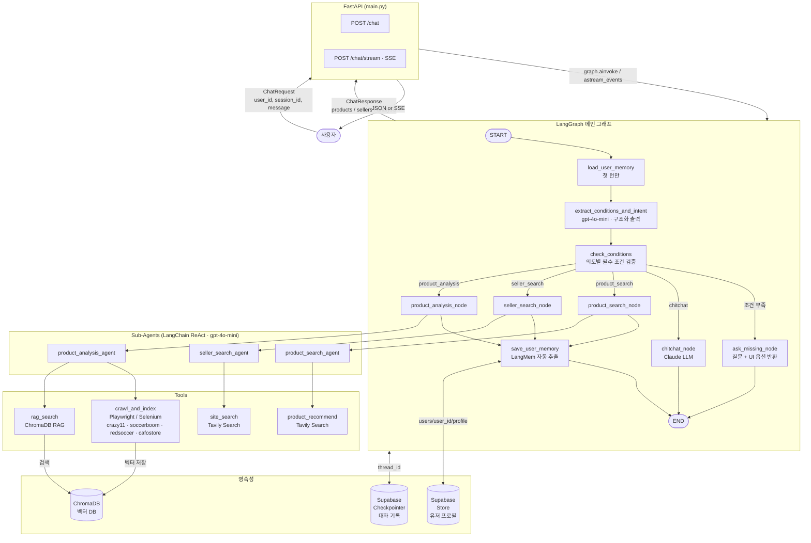

# 인터뷰 형식
- 작업을 수행하는 과정에서 모르거나 애매한 게 있으면 인터뷰 형식 (카드 형식)으로 질문해주세요.

---

# Buyer Agent SaaS - Backend

## Overview
LangGraph + FastAPI 기반 AI 쇼핑 에이전트. 사용자 조건 수집 → 상품/판매자 크롤링 → RAG 검색 → 분석 결과 반환.

## Entry Point
- 실행: `uvicorn FastAPI.main:app --reload`
- API 서버: `FastAPI/main.py` (현재 버전)
- 구버전: `main.py` (레거시, 수정 X)

## Tech Stack
- Agent: LangGraph + LangMem (개인화)
- LLM: Claude (Anthropic)
- API: FastAPI + SSE 스트리밍
- Vector DB: ChromaDB (RAG)
- Scraping: Playwright, Selenium, Firecrawl
- Korean NLP: KoNLPy, Kiwi

## Architecture

## Folder Map
각 폴더의 Claude.md에 상세 내용 있음.
- `Agent/` → LangGraph 에이전트 구현
- `Tools/` → 도구 함수 (RAG, 크롤링, 정규화)
- `FastAPI/` → REST API 서버
- `State/` → AgentState 정의
- `Crawling/` → 셀러 크롤러
- `Chain/` → LangChain 체인
- `MCP/` → Model Context Protocol
- `Userprofile/` → 유저 프로필 관리
- `Test/` → 테스트

## Conventions
- 한국어 주석 사용

## 자동 업데이트 규칙 (필수)
작업이 끝날 때마다 반드시 아래 두 파일을 업데이트할 것:

1. **해당 폴더의 `TODO.md`**
   - 작업한 내용 → `- [x]` 완료 항목으로 추가
   - 발견한 버그 / 남은 작업 → `- [ ]`로 추가

2. **해당 폴더의 `Claude.md`**
   - 새로운 파일이 생겼거나 구조가 바뀌었을 때만 업데이트
   - 변경 없으면 그대로 둘 것
